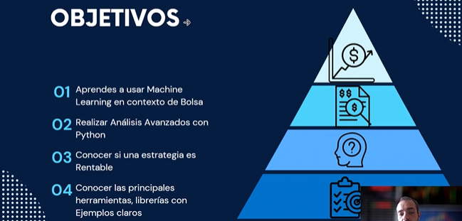

# Trading Algorítmico con Python
Repositorio de Trading Algorítmico con Python

En este curso se aprenderan los fundamentos del trading algorítmico utilizando Python. Desde la creación de estrategias de trading hasta la implementación de algoritmos, explorarás las herramientas y técnicas más relevantes en el campo.

El curso tiene los siguientes objetivos

## Temario

Y para ello, el código se divide en los siguientes capitulos:

1. Extracción de datos con (API Alpaca,Alpavantage, Polygon)
   
    - Extracción Datos Alpaca 
    - Indicadores Tecnicos con Alphavantage 
    - Obtener datos de Forex con Polygon API 

2. Machine Learning con Python
    - Extracción de datos del SP500 
    - Clutesting usando Kmeans 
    - Predección del precio de Apple 
    - Análisis de Sentimiento en Empresas 
    - Detección de Patrones
    - Top 30 ETFs EEUU con Python

3. TradingView
    - Backtesting
    - Estrategia RSI 
    - Estrategia Basada en Bandas de Bollinger 

4. Backtesting y Desarollo de Estrategias
    - Introducción al backtesting con Python 5:53
    - Estrategia basada en Momentum 6:01

4. Análisis de Riesgo y Optimización de Carteras0/3 Lecciones Completadas
    - Análisis de Riesgo Métricas 4:43
    - Calculo Medidas de Riesgo en Python 10:57
    - Optimización de Pesos y Análisis de Rendimientos 11:21

El curso cuenta con más capítulos pero al no tenér código no se consideran para este repositorio
